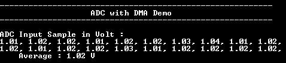

# ADC DMA Mode

This example application shows how to couple the ADC and the XDMAC peripherals to automatically transfer the data conversion of an analog input into internal memory. After the DMA transfer, teh results of the converted samples are printed to the console.

## Description

In this example, Analog input voltage in the range of 0 V to 3.3 V (from potentiometer) is fed to the ADC and converted value is displayed on the console. The ADC conversion is triggered once in freerun mode and XDMAC transfers are started every seconds to capture a set of samples.

## Downloading and building the application

To clone or download this application from Github, go to the [main page of this repository](https://github.com/Microchip-MPLAB-Harmony/csp_apps_sam_rh707) and then click **Clone** button to clone this repository or download as zip file.

Path of the application within the repository is **apps/adc/adc_dma_mode/firmware** .

To build the application, refer to the following table and open the project using its IDE.

| Project Name      | Description                                    |
| ----------------- | ---------------------------------------------- |
| sam_rh707_ek.X | MPLABX project for [SAM RH707 Evaluation Kit](https://www.microchip.com/en-us/development-tool/SAMRH707F18-EK) |
|||

## Setting up the hardware

The following table shows the target hardware for the application projects.

| Project Name| Board|
|:---------|:---------:|
| sam_rh707_ek.X | [SAM RH707 Evaluation Kit](https://www.microchip.com/en-us/development-tool/SAMRH707F18-EK) |
|||

### Setting up [SAM RH707 Evaluation Kit](https://www.microchip.com/en-us/development-tool/SAMRH707F18-EK)

- Connect the Debug USB port on the board to the computer using a micro USB cable
- Connect the debugger probe to J5 connector
- Connect the J1 (USB-C) port on the board to the computer using a USB-C cable

## Running the Application

1. Open the Terminal application (Ex.:Tera term) on the computer
2. Connect to the USB to UART COM port and configure the serial settings as follows:
    - Baud : 115200
    - Data : 8 Bits
    - Parity : None
    - Stop : 1 Bit
    - Flow Control : None
3. Build and Program the application project using its IDE
4. Reset the board to run the application
5. Vary ADC input voltage from potentiometer (R109 - POT) and observe ADC count on console

    
