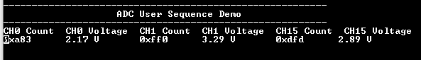

# ADC user sequence

This example application shows how to sample three analog inputs using the user sequencer in software trigger mode and send the converted data to the console.

## Description

Conversion of the three analog inputs is triggered from software trigger at every 500 ms. The user sequencer is used to define the order of conversion:

| Board | Sequence of conversion |
| ----- | ---------------------- |
| [SAM RH707 Evaluation Kit]() |  AD1 --> AD15 --> AD0 |
|||

Analog input voltage in the range of 0 V to 3.3 V is fed to the ADC input channel AD0, AD1 and AD15 (from potentiometer). ADC conversion result is displayed on the console.

## Downloading and building the application

To clone or download this application from Github, go to the [main page of this repository](https://github.com/Microchip-MPLAB-Harmony/csp_apps_sam_rh707) and then click **Clone** button to clone this repository or download as zip file.
This content can also be downloaded using content manager by following these [instructions](https://github.com/Microchip-MPLAB-Harmony/contentmanager/wiki).

Path of the application within the repository is **apps/adc/adc_user_sequence/firmware** .

To build the application, refer to the following table and open the project using its IDE.

| Project Name      | Description                                    |
| ----------------- | ---------------------------------------------- |
| sam_rh707_ek.X | MPLABX project for SAM RH707 Evaluation Kit() |
|||

## Setting up the hardware

The following table shows the target hardware for the application projects.

| Project Name| Board|
|:---------|:---------:|
| sam_rh707_ek.X | SAM RH707 Evaluation Kit() |
|||

### Setting up SAM RH707 Evaluation Kit

- Connect the Debug USB port on the board to the computer using a micro USB cable
- Connect the debugger probe to J5 connector
- Connect the J1 (USB-C) port on the board to the computer using a USB-C cable
- Use a jumper wire to connect Pin 3 of J20 (AD0 is mapped to Port Pin PA0) to 3.3 V or GND
- Use a jumper wire to connect Pin 4 of J20 (AD1 is mapped to Port Pin PA1) to 3.3 V or GND
- AD15 is connected to potentiometer (R109 - POT)

## Running the Application

1. Open the Terminal application (Ex.:Tera term) on the computer
2. Connect to the EDBG Virtual COM port and configure the serial settings as follows:
    - Baud : 115200
    - Data : 8 Bits
    - Parity : None
    - Stop : 1 Bit
    - Flow Control : None
3. Build and Program the application project using its IDE
4. Reset the board to run the application
5. The console displays the ADC Count and the ADC Input Voltage

    
